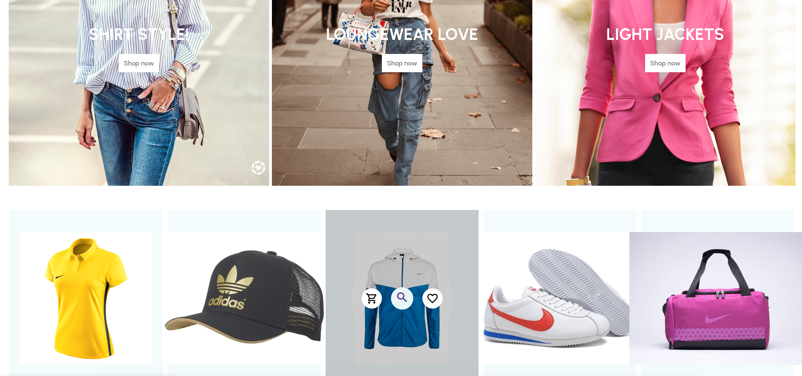
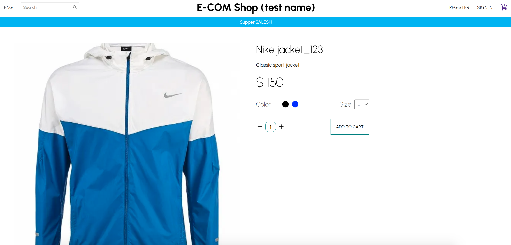
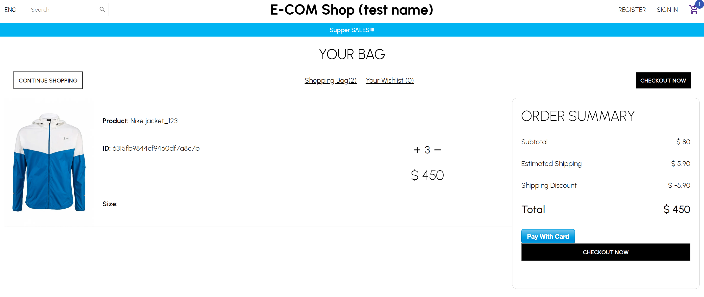
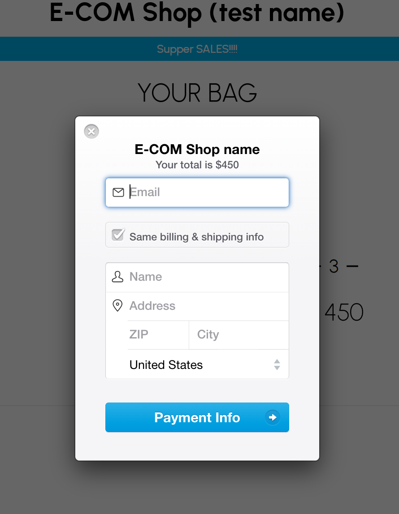
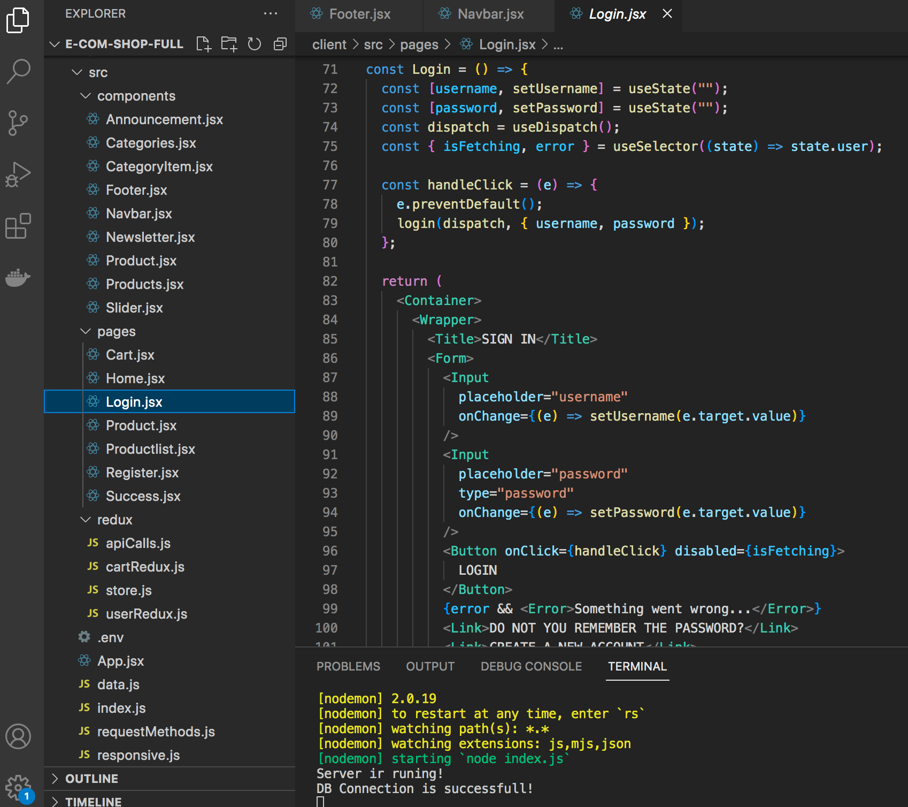
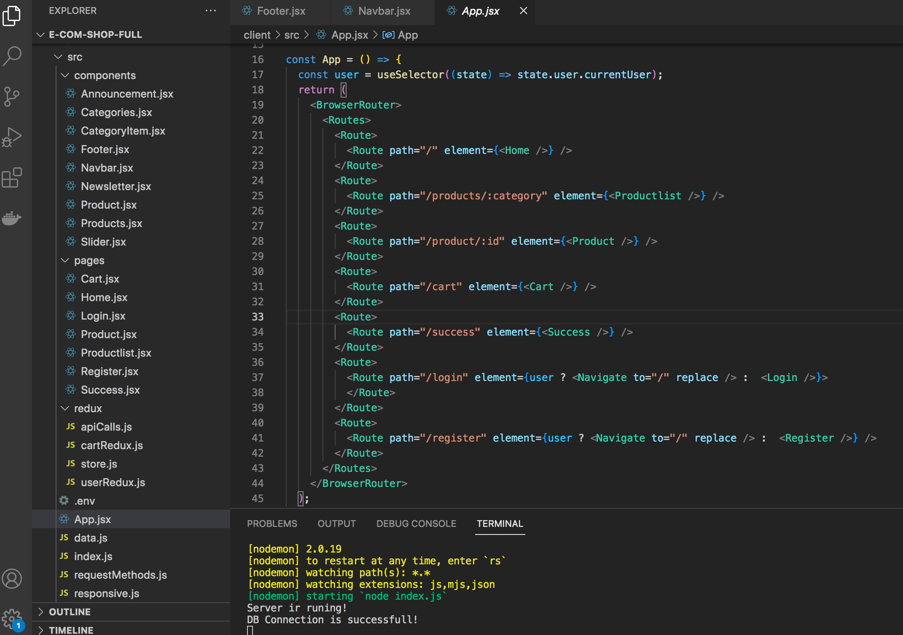
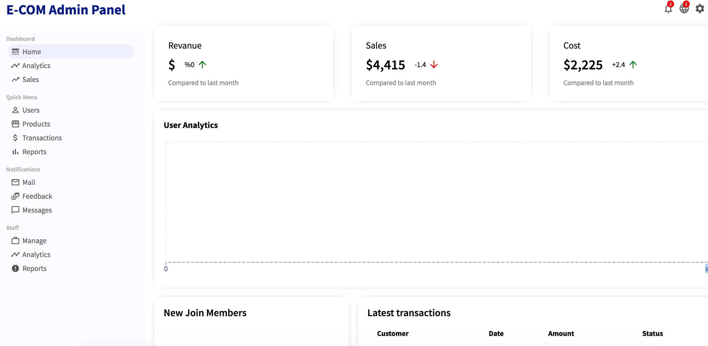

# E-COM Shop
Commercial development
____
***Technology stack**: React, Redux toolkit, Node.js, MongoDB, axios*
____
Online clothing store with:
1. Admin panel
2. Login/register pages
3. Payment functionality
4. Basket page
5. Product cart page.
6. API (MongoDB)

____
# Screans:

### Product page

### Order

### Payment

### Login functionality

### Admin panel

____
**npm start**

### *Not full application becouse I can't send full. Only for your understanding.*